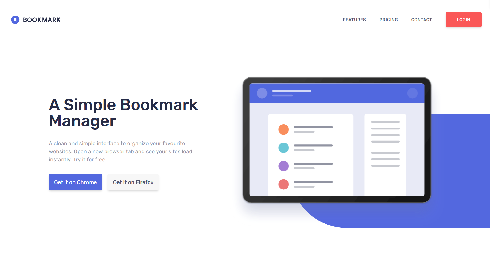

# Frontend Mentor - Bookmark landing page solution

This is a solution to the [Bookmark landing page challenge on Frontend Mentor](https://www.frontendmentor.io/challenges/bookmark-landing-page-5d0b588a9edda32581d29158). Frontend Mentor challenges help you improve your coding skills by building realistic projects.

## Table of contents

- [Overview](#overview)
  - [The challenge](#the-challenge)
  - [Screenshot](#screenshot)
  - [Links](#links)
- [My process](#my-process)
  - [Built with](#built-with)
  - [What I learned](#what-i-learned)
  - [Continued development](#continued-development)
  - [Useful resources](#useful-resources)
  - [AI Collaboration](#ai-collaboration)
- [Author](#author)

## Overview

### The challenge

Users should be able to:

- View the optimal layout for the site depending on their device's screen size
- See hover states for all interactive elements on the page
- Receive an error message when the newsletter form is submitted if:
  - The input field is empty
  - The email address is not formatted correctly

### Screenshot



### Links

- Live Site URL: [Add live site URL here](https://bookmark-landing-page-master-gamma-two.vercel.app/)

## My process

### Built with

- Semantic HTML5 markup
- CSS custom properties!
- TailwindCSS
- Flexbox
- Mobile-first workflow

### What I learned
#### HTML semantics
1. Difference between article and section tag - when to use which.
	
	The `article` tag is used for reusable parts of the page like a card. The `section` tag is to group different parts of the page into sections.
	
	For different sections like hero, features, etc we use `section` tag.
	For a card in features section we use `article` tag.

2. No other elements to be used in a `ul, ol` except `li` (obvious I know)
	
	The screen reader read "list with 8 items" though there were four questions and I knew something was worng.
	No other elements could be present in `ul, ol` tags except `li`. Obvious, but I added `hr` and realized it breaks the accessibility later, though visually it makes no difference. Screen reader counts **x items in list**. 
#### Accessibility
1. For accordion radio element with CSS alone isn't good for control and accessibility.
	
	Switched from `radio` elements to `button` for questions and `p` tag for answers, for better control and accessibility. 
	Thought using `radio` gives you CSS-only but if using a bit of JS is better for accessibility and control.

2. Always test with a screen reader.
	
	Real testing with screen reader gives empathy rather than accessibility feeling like a chore.

#### JavaScript

1. Keeping one FAQ expanded at a time.
	
	I did this by:
	- Upon click on FAQ, it's status (active / inactive) is stored in a `const`
	- A function `collapseAll` is called which gives the status of **inactive** to all FAQs
	- Now, the FAQ is toggled depending on it's current status.

2. We can check if a class exists with JS
The code below gives back a boolean.
```js
faq.classList.contains("active");
```


### Continued development
- Better testing and approach to accessibility.
- Would like to explore setting up a coherent spacing for the project as it's base.
### Useful resources
 - [minmax calculator](https://min-max-calculator.9elements.com/?) - Gives us the `clamp` calculations for a responsive design.
 - [font awesome](https://fontawesome.com/) - Great resource to get icons.
 - [An interactive guide to CSS transitions](https://www.joshwcomeau.com/animation/css-transitions/) - Taught me the foundations of CSS transitions.
 - [FAQ Accordion tutorial](https://www.youtube.com/watch?v=4qnWreynXLU) - Great tutorial on how to make an accordion with HTML, CSS and JS
 - [Difference between article and sections tag - Gfg](https://www.geeksforgeeks.org/html/difference-between-article-tag-and-section-tag/) - Taught me the real difference between article and section tags and their applications.
### AI Collaboration

Used ChatGPT and copilot as a teacher, helping me understand concepts deeper and walk me through what I'm doing wrong. It's usage helped me with accessibility, semantics and debug.
## Author
- Frontend Mentor - https://www.frontendmentor.io/profile/nazeeha-kb
- Twitter - https://x.com/Nazeeha126889